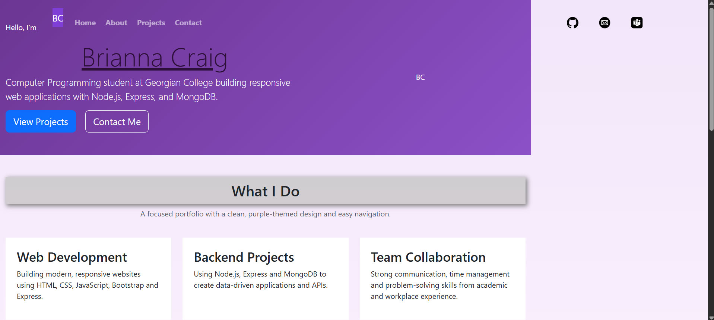

<!-- Copilot Sessions -->

 <!-- 6 b -->

prompt: Would you please scan my project and document the technology stack

Reply:
Reviewing the workspace files to identify the project’s technology stack.

Project Technology Stack
Core stack
Node.js
npm

Assignment 01 web app
Express framework
hbs templating engine (Handlebars view engine)
MongoDB database via Mongoose
dotenv for environment configuration
cookie-parser for cookies
morgan for request logging
http-errors for HTTP error handling

Project structure
app.js — main Express app setup
www — app startup script
routes — route handlers
views — HBS templates
public — static assets
configs — global config values
Additional workspace package
Root package.json includes dependency:
prompt

The main functional app is ASSIGNMENT01, which is a Node/Express/MongoDB application using server-side Handlebars rendering.

<!-- 6 c -->
Prompt: can you now scan my project structure and document it

Reply:
I'll create a short plan, then list all files recursively to build a detailed project tree.

Now I'll list all files in the workspace to capture the full project structure.

Next I'll write DETAILED_STRUCTURE.md containing a full file tree and brief notes.

Edited
DETAILED_STRUCTURE.md+56-1
I'll mark the scan and documentation steps completed in the todo list.

Progress update: I scanned the workspace and added a detailed file tree.

Created: DETAILED_STRUCTURE.md
Would you like a route-to-view diagram, or an README.md with environment
variable examples?

<!-- 6e -->

prompt 1: read both the .github/copilot-context.md and .github/copilot-instructions.md and use them as project context

Reply:
Project context loaded
I reviewed both files in .github:

copilot-context.md

Confirms the app is a Node.js/Express/MongoDB project
Uses hbs for templating
Includes dotenv, cookie-parser, morgan, and http-errors
Main app lives in ASSIGNMENT01
copilot-instructions.md

Build a personal portfolio site with Node.js, Express, HBS, Bootstrap, MongoDB
Required pages: Home/Index, About, Projects, Contact
Keep it simple, professional, responsive, with working navigation
Use cards for projects
Purple color scheme, Georgina font, CSS hover/active effects

I’ll use that as the project requirements going forward.

prompt 2: generate the content please

Reply:
✅ Updated successfully

What changed:

layout.hbs: switched Google font to Georgiana
style.css: appended final portfolio overrides for purple theme, responsive hero/footer styles, and font enforcement
If you want, I can now run a quick check for missing class names or broken layout areas in the views.

prompt 3: fix the layout, its now all broken 

Reply:
I see the problem—the old CSS has global h1 and h2 rules that are breaking everything (centering, underlines, forced flex). Let me completely rewrite the stylesheet with clean, modern portfolio CSS:

✅ Fixed! Replaced the entire stylesheet with a clean portfolio CSS that removes all the old broken rules (global h1/h2 centering, underlines, etc.).

The new stylesheet includes:

Proper typography with Georgiana font
Purple gradient hero section
Card styling with hover effects
Responsive navigation
Footer grid layout
Mobile responsive design
The layout should now render correctly with proper spacing, alignment, and the purple theme intact.

prompt 4:
make the header nav a purple colour and make any button a purple not blue

reply:
✅ Done! Updated:

Header nav to solid purple (#7f3fd6)
Primary buttons (View Projects, etc.) to purple with darker hover state

prompt 5: top nav is still showing as clear, not pruple

✅ Fixed! Added purple background directly to .navbar with !important to override Bootstrap's defaults. The nav should now be purple.

prompt 6: email me button is also blue

✅ Updated the "Contact Me" button to purple with a semi-transparent purple background and solid purple on hover.